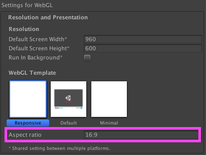

# WebGL responsive template

Get a minimal responsive template for your WebGL games and apps!

You can also set a fixed aspect ratio!

## Why?

By default, unity WebGL templates require a fixed canvas size that, while good enough for some cases, tends to be too limiting in many situations. I created this repository because I needed a way to resize the canvas to fit the screen automatically and I couldn't find any other prepackaged solution.

## Usage

1. Import the `Packages/WebglResponsiveTemplate.unitypackage`
2. Select the _Responsive_ template under WebGL player settings
3. Build and run :)
